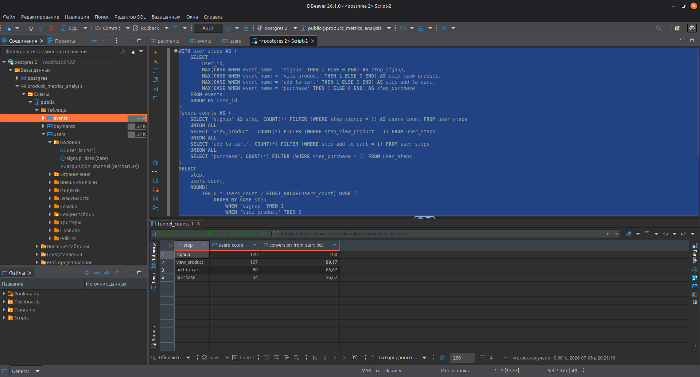
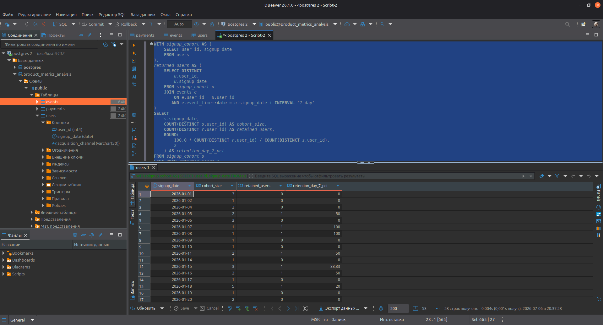
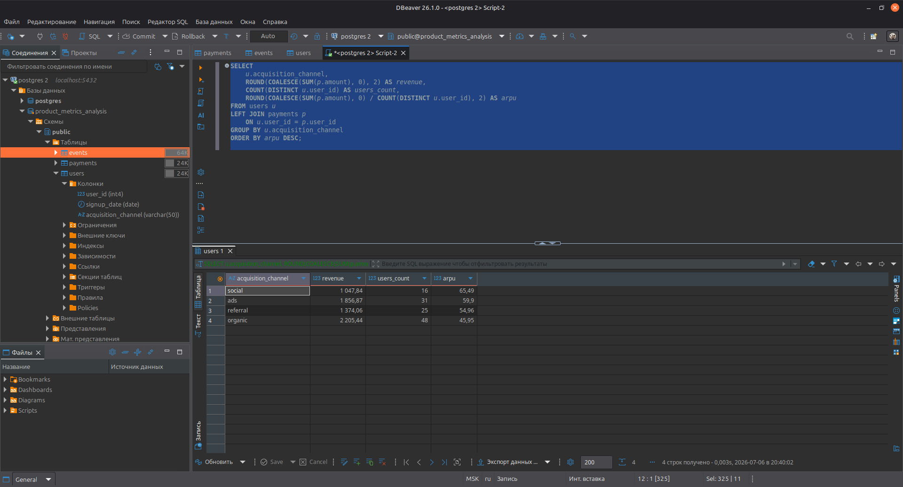

# product_metrics_analysis
SQL-проект по продуктовой аналитике на PostgreSQL.
В проекте рассчитаны ключевые метрики продукта: **funnel**, **Day 7 retention** и **ARPU** на основе e-commerce датасета.

## Стек
- PostgreSQL
- SQL
- DBeaver
- Ubuntu Linux

## Что внутри
- `dataset/` — исходные CSV-данные
- `sql/` — SQL-запросы для расчёта метрик
- `results/` — результаты запросов и скриншоты

## Метрики
- Funnel: `signup - view_product - add_to_cart - purchase`
- Retention: Day 7 retention
- ARPU: средняя выручка на пользователя
- ARPU by channel: ARPU по каналам привлечения

## Результаты

### Funnel

- От регистрации до просмотра товара доходит ~89% пользователей — верхняя часть воронки работает достаточно хорошо.

- Между view_product и add_to_cart конверсия падает с 89.17% до 66.67% от старта, то есть примерно 25–30% пользователей не совершают шаг «добавление в корзину» — это первый заметный провал.

- На пути от add_to_cart до purchase конверсия падает с 66.67% до 36.67%, то есть 30% пользователей не совершают шаг «оплаты» — этой второй и уже ключевой провал.

### Retention

- Анализ Day 7 retention показывает сильную вариативность удержания по дням регистрации: у значительной части когорт удержание на 7‑й день равно 0%, а у некоторых небольших когорт достигает 50–75%. Для когорт с более заметным размером (5–7 пользователей) Day 7 retention чаще находится в диапазоне 14–67%, что в целом указывает на средне‑низкий уровень удержания и потерю значимой части аудитории уже в первую неделю после регистрации.

### ARPU by channel

- ARPU по каналам показывает, что organic даёт наибольший объём пользователей, но с минимальной выручкой на пользователя (ARPU ≈ 45.95), тогда как social и ads, несмотря на меньший объём, обеспечивает максимальный ARPU (≈ 65.49) и (≈ 59.9). Это означает, что с точки зрения монетизации приоритет стоит сместить в сторону каналов social и ads.

## Улучшения

• Заметная кнопка «Добавить в корзину»: Она должна быть яркой, контрастной (заметно выделяться на фоне остальных элементов) и крупной.
• Наглядная инфографика и видео: Добавление качественных фото, видеообзоров или 3D-моделей.
• Доверие и социальные доказательства: Размещение среднего рейтинга и отзывов с фотографиями.
• Прозрачность: Добавление актуальной цены и сроков доставки.
• Скорость загрузки: Проверка, что страница сайта, открывается моментально.
• Адаптация под мобильные устройства: Проверка адаптации интерфейса под мобильные устройства.
• Push-уведомления и email-рассылки: Добавление персональных рекомендаций или оповещения о бонусах и акциях. Напоминания о брошенных корзинах.
• Кросс-продажи и апсейл: Предложение сопутствующих товаров во время оформления заказа. Автоматические триггеры, рекомендующие премиальные версии продуктов.
• Обратная связь: Провести опрос среди ушедших, чтобы понять причины. 
